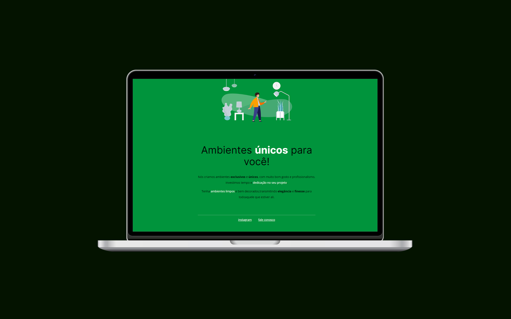

<h1 align="center">Móveis Customizados</h1>

  

  

## 💻 Projeto

O Móveis Customizados é um projeto com objetivo de treinamento do Curso Rocketseat.

- [Acesse o projeto](https://explorer-danilitoxp.vercel.app/)

## 🚀 Tecnologias

Esse projeto foi desenvolvido com as seguintes tecnologias:

- HTML e CSS
- Git e Github
- Figma